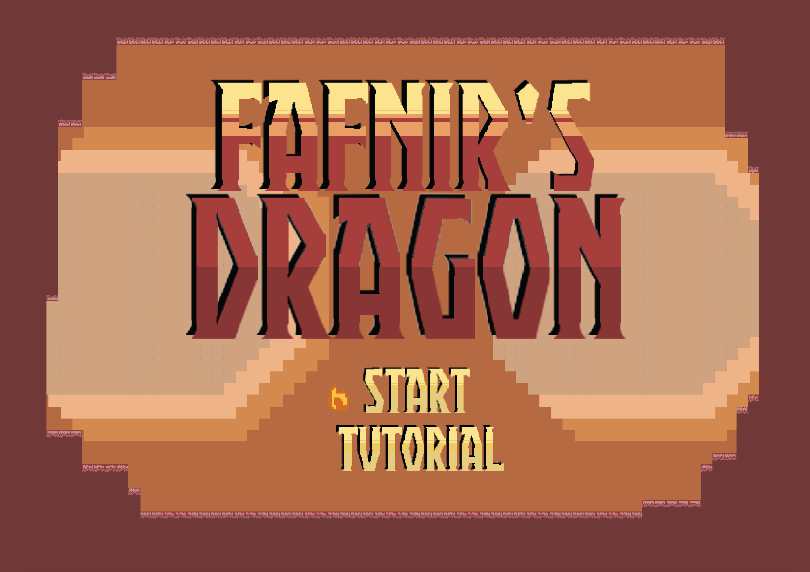

# Fafnir’s Dragon

A 2D platform game created as part of a semester long class with two classmates. The game implements two playing levels for users to choose from and has a high score ranking at the end of each play. Maneuver through intricately designed environments and beat the final boss to win the game.

:arrow_right: [Live Preview](https://paigebraun.github.io/fafnirs-dragon/)

## Demo

https://paigebraun.github.io/fafnirs-dragon/

Select 'Start' or 'Tutorial' and hit enter.
## Screenshots

## Tech Stack

HTML, CSS, Javascript, Phaser 3, TileMaps
